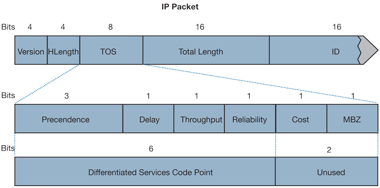

# QoS

QoS (Quality of Service) is a mechanism to identify and priotize traffic. Common use cases are Video and Voice.\
If the link is saturated it will prioritize voice and video packets and drop other traffic.

## FortiSwitch QoS methods

**Ingress Traffic**

**Marking**: Existing CoS and DCP markings in packet are kept or remarked.\
**Classification**: Packet with matching CoS or DSCP Marking are mapped to an egress queue (8 queues per port available)

**Egress Traffic**

**Queuing**: Packets are processed based on scheduling and queue priority. During link congestion, packets may be dropped based on drop policy.

**Rate limiting**: Packets exceeding maximum rate are dropped\
Packets below minimum rate are not dropped.

8 Queues are available. Queue 0 has the lowest priority, and packets will be dropped first.

Queue 7 contains control traffic like LLDP and FortiLink protocol. It's recommened to not assign any user traffic to the 7th queue.

Marking can be achieved by ACLs (Access Control Lists) on the FortiSwitch. Alternatively, devices can be instructed on marking through LLDP-MED TLVs . LLDP-MED can inform a VOIP phone to switch VLANs and assign CoS or DSCP value.

## Class of Service (CoS)

IEEE 802.1p\
Information is added to the ethernet header (VLAN)\


it's important to note that CoS's applicability is somewhat limited. It is not an end-to-end traffic prioritization solution; its effectiveness is confined within a single LAN or VLAN. Once traffic crosses router boundaries, CoS tags are typically not preserved. Nevertheless, within its operational domain, CoS is highly effective, and network switches that support it can leverage these tags to manage congestion and prioritize traffic, often by placing Ethernet frames into different queues based on their assigned CoS value.

Since FortiSwitch does not look at its inner packets in Q-in-Q packets, which could contains the IP information (DSCP). The CoS is needed here.

The IEEE broadly defines following values:

| Queue | Acronym | Traffic type                       |
| ----- | ------- | ---------------------------------- |
| 0     | BK      | Background                         |
| 1     | BE      | Best Effort                        |
| 2     | EE      | Excellent Effort                   |
| 3     | CA      | Critical Applications              |
| 4     | VI      | Video, < 100 ms latency and jitter |
| 5     | VO      | Voice, < 10 ms latency and jitter  |
| 6     | IC      | Internetwork Control               |
| 7     | NC      | Network Control                    |


## Differentiated Service Code Point (DSCP)

DSCP is a mechanism used in Layer 3 of the OSI model, within the IP header. It's part of the IP packet and is used for traffic classification and management across networks.

<figure><figcaption></figcaption></figure>

DSCP is specified in the 6-bit Differentiated Services (DS) field in the IP header. This allows for 64 different traffic classes.

Commonly used code points:

| DSCP | DSCP Description          | Legacy IP Precedence                                                                                                      | Legacy IP ToS (D, T, R) |
| ---- | ------------------------- | ------------------------------------------------------------------------------------------------------------------------- | ----------------------- |
| 0    | Best effort               | 0 (Routine – 000)                                                                                                         | -                       |
| 8    | Class 1                   | 1 (Priority – 001)                                                                                                        | -                       |
| 10   | Class 1, gold (AF11)      | 1 (Priority – 001)                                                                                                        | T                       |
| 12   | Class 1, silver (AF12)    | 1 (Priority – 001)                                                                                                        | D                       |
| 14   | Class 1, bronze (AF13)    | 1 (Priority – 001)                                                                                                        | D, T                    |
| 16   | Class 2                   | 2 (Immediate – 010)                                                                                                       | -                       |
| 18   | Class 2, gold (AF21)      | 2 (Immediate – 010)                                                                                                       | T                       |
| 20   | Class 2, silver (AF22)    | 2 (Immediate – 010)                                                                                                       | D                       |
| 22   | Class 2, bronze (AF23)    | 2 (Immediate – 010)                                                                                                       | D, T                    |
| 24   | Class 3                   | 3 (Flash – 011)                                                                                                           | -                       |
| 26   | Class 3, gold (AF31)      | 3 (Flash – 011)                                                                                                           | T                       |
| 27   | Class 3, silver (AF32)    | 3 (Flash – 011)                                                                                                           | D                       |
| 30   | Class 3, bronze (AF33)    | 3 (Flash – 011)                                                                                                           | D, T                    |
| 32   | Class 4                   | 4 (Flash Override – 100)                                                                                                  | -                       |
| 34   | Class 4, gold (AF41)      | 4 (Flash Override – 100)                                                                                                  | T                       |
| 36   | Class 4, silver (AF42)    | 4 (Flash Override – 100)                                                                                                  | D                       |
| 38   | Class 4, bronze (AF43)    | 4 (Flash Override – 100)                                                                                                  | D, T                    |
| 40   | Express forwarding        | 5 (CRITIC/ECP[1](https://help.sonicwall.com/help/sw/eng/7110/26/2/4/content/Firewall\_Managing\_QoS.088.3.html#15) – 101) | -                       |
| 46   | Expedited forwarding (EF) | 5 (CRITIC/ECP – 101)                                                                                                      | D, T                    |
| 48   | Control                   | 6 (Internet Control – 110)                                                                                                | -                       |
| 56   | Control                   | 7 (Network Control – 111)                                                                                                 | -                       |

#### Main differences between CoS and DSCP

* **Scope**: CoS is limited to VLANs and LANs, while DSCP works across network boundaries.
* **Granularity**: DSCP offers more detailed traffic classification than CoS.
* **Application**: CoS is primarily used in Ethernet frame tagging, whereas DSCP is used within IP packets.

Based on the CoS and DSCP markings it classifies ingress packets into queues.&#x20;

FortiSwitch scheduling methods:

| Mode                 |                                                                                                          |                                          |
| -------------------- | -------------------------------------------------------------------------------------------------------- | ---------------------------------------- |
| Strict               | Process packets in high number queues first. If higher priority queues are empty, check next queue, etc. | Lower priority traffic could starve      |
| Round Robin          | Cycle though each queue and process a single packet                                                      | Fair traffic distribution for all queues |
| Weighted Round Robin | Process more packets from queues with higher weights                                                     | Lower priority traffic never starves     |

Before or during concestion, the switch may drop packets based on the drop policy set configured on the queue:

Drop Policies

| Mode                                   |                                                                                                 |                                                                                 |
| -------------------------------------- | ----------------------------------------------------------------------------------------------- | ------------------------------------------------------------------------------- |
| Tail-drop                              | Drop incoming packets until egress port isn't congested                                         | Unfair traffic distribution among traffic flows (especially non-bursty traffic) |
| Random early detection (RED)           | <p>Drop packets at a constant rate before buffers are full. Continously monitors queues<br></p> |                                                                                 |
| Weighted Random Early detection (WRED) | Same as RED but differs between queue priorities                                                |                                                                                 |

ECN


## Rate limiting

Set a maximum rate on a queue\
\- drops packets when traffic exceeds configured maximum rate\
\
Set a mimum rate on a queue\
\- Guarantees minimum bandwidth on a queue


## Configuration

Classification by CoS Value

```
config switch-controller qos dot1p-map
    edit <dot1p-map-name>
        set priority-0 <queue-num>
        set priority-1 <queue-num>
        ...
        set priority-7 <queue-num>
    next
end
```

Classification by DSCP Value

```
config switch-controller qos ip-dscp-map
    edit "voice-dscp"
        config map
            edit "1"
                set cos-queue 1
                set value 46
            next
            edit "2"
                set cos-queue 2
                set value 24,26,48,56
            next
            edit "5"
                set cos-queue 3
                set value 34
            next
        end
    next
end
```

Configure a queue-policy. Switches without WRED will fall back to RED if weighted-random-early-detection is enabled.\
RED and WRED support the ECN flag.

If schedule is set to weighted, it's possible to configure a weight to the queue.

```
config switch-controller qos queue-policy
    edit "test"
        set schedule round-robin | strict | weighted
        set rate-by kbps | percent
        config cos-queue
            edit "queue-0"
                set min-rate <kbps>
                set max-rate <kbps>
                set drop-policy taildrop
                set ecn enable
            edit "queue-1"
                set drop-policy weighted-random-early-detection
                set weight <weight>
                set ecn enable
            edit "queue-2"
```


```
config switch-controller qos qos-policy
    edit "test"
        set default-cos <queue>
        set trust-dot1p-map <dot1p-map>
        set trust-ip-dscp-map <ip-dscp-map>
        set queue-policy "default"
```

Traffic without a match is place in queue 0.


View QoS Status:

```
#diagnose switch-controller switch-info qos-stats S224EPTF123456789 port1
```

View QoS real-time on FSW:

```
FSW# diagnose switch physical-ports qos-rates list port1

```

source: [https://help.sonicwall.com/help/sw/eng/7110/26/2/4/content/Firewall\_Managing\_QoS.088.3.html](https://help.sonicwall.com/help/sw/eng/7110/26/2/4/content/Firewall\_Managing\_QoS.088.3.html)

