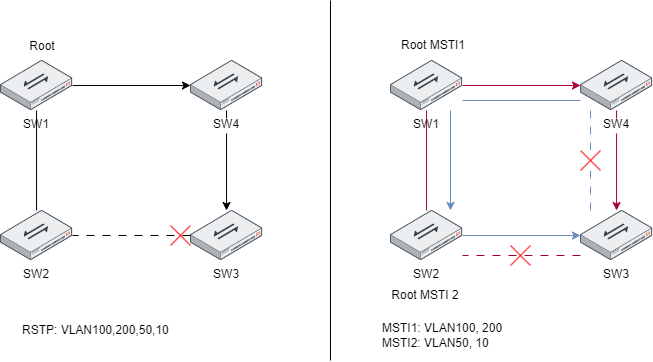

# Spanning Tree

In a FortiLink managed switch setup MSTP (multiple spanning tree protocol) is enabled out of the box.

The big advantage of MSTP is, that you can map VLANs to a MSTP instance. In a classic RSTP setup, the switch does not differ between the VLANs. So all VLANs, will pass through the same link. With MSTP it's possible to defined different root bridges for different VLAN groups. Thus enable multiple paths.

In the example below we have 4 vlans. The difference and advantage can be looked at, by the path a packet takes by going from SW1 to SW3.

In RSTP Mode, there is a single spanning tree, so all packets in all VLANs will take the Path SW1->SW4->SW3 to reach Switch3.

In MSTP mode, we have assigned VLAN100, and VLAN200 to MSTI1 and the rest to MSTI2. SW2 is the root bridge for MSTI2. So it calculate two different topologies for each MSTI.\
Now for VLAN100,200 the path ist the same as the RSTP. But for VLAN50,10 to packet traverses SW1->SW2->SW3.

<figure><figcaption></figcaption></figure>

**MSTI**: Muliple Spanning Tree Instance. \
**IST**: Default Instance (MSTI 0). Contains all unmapped vlans.\
**MSTP Region**: \
**CST**: Common Spanning Tree

The default Fortilink MSTP settings are:

```
SW1 # diagnose stp mst-config list
  MST Configuration Name: 
  MST Configuration Revision: 0
  MST Configuration Digest: 9999b43d77cc58bba8854f9991c4a487

  Instance ID      Mapped VLANs     Priority
____________________________________________________
           0                           24576
          15              4094         24576
```

The FortiLink management VLAN (default 4094) is put into its own instance ID : 15. All other VLANs are mapped to instance 0.

MSTP is backward compatible with RSTP (rapid spanning tree protocol) and STP.\
Every switch, which does not have the same MSTP settings (name, revision, vlan mapping digest) or is using a different variant (STP, RSTP) will be moved into it's own MSTP region.

## MSTP Regions

Switches using the same MSTP settings are assigned to the same region. The settings which are compare are:

* Region name
* MST revision number
* MSTI to VLAN Number (MD5 Digest of the table)

Other regions are either MSTP with different settings or different protocol (STP or RSTP).

When MSTP regions connect, they appear to the external world as a single virtual bridge, ensuring compatibility with traditional STP and Rapid Spanning Tree Protocol (RSTP) domains. Proper configuration of MSTP regions ensures optimal path selection, load balancing, and efficient network convergence.


STP Edge Port: Ports connected to an endhost. The port will allow forwarding immediately. Because no loops is expected. If it still receives a BPDU, it loses it's edge status and becomes a regular STP port.

