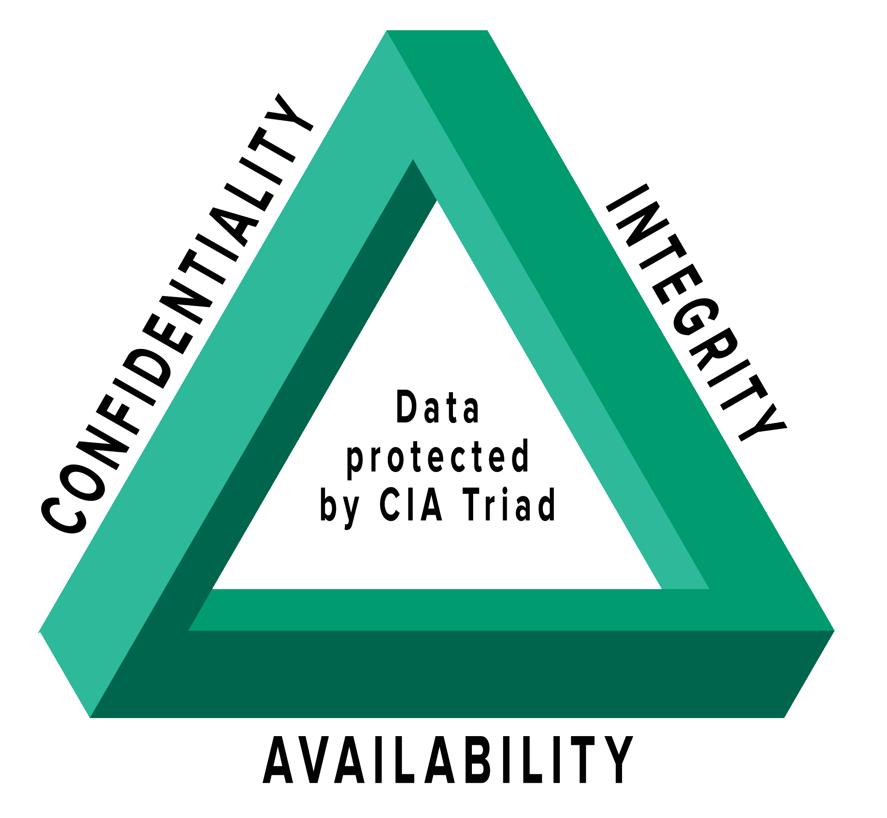
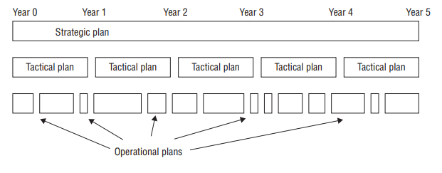

# 1 Security Governance Through Principles and Policies

## CIA Triad

<figure><figcaption></figcaption></figure>

* Primary goal and objectives of a security infrastructure
* Security controls are typically evaluated on how well they address the triad
* Vulnerabilities and risk also evaluated based on the on the threat they pose against on of the CIA Triad principle

**Confidentially**: Prevent or minimize unauthorized access to data\
**Integrity:** Protect the reliability and correctness of data\
**Availability**

## **Confidentially**

Concepts, Conditions and aspects of confidentially:

**Sensitivity**: Quality of information, which could harm

**Discretion**: Act of decision where an operator can influence or control disclosure n order to minimize harm or damage

**Critically**: The level of which information is mission critical. The higher the level, the more likely the need to main confidentially

**Concealment**: Act of hiding or preventing disclosure. Means of cover, obfuscate or distract. Related concept: security through obscurity.

**Secrecy**: act of keeping something secret

**Privacy**: Keeping information confidential that is personally identifiable or might cause harm, embarrassment or disgrace to someone if revealed

**Seclusion**: Storing something in an out-of-the-way location, likely with strict access control

**Isolation**: Act of keeping something seperated from others

## Integrity

Can be examined from three perspectives:

* Preventing unauthorized subjects from making modifications
* Preventing authorized subjects from making unauthorized modifications (mistakes)
* Maintaining the internal and external consistency of objects so that their data is correct

Attacks on integrity: Viruses, Logic Bombs, Unauthorized Access, errors in coding or applications, malicious modifications, system backdoors

Countermeasures: Strict access control, rigorous authentications procedures, IDS, object/data encryption, hash verification

Confidentially and Integrity depend on each other. Without object Integrity, confidentially cannot be maintained

&#x20;Concepts, Conditions and aspects of integrity:

Accuracy: Being correct and precise

Truthfulness: Being a true reflection of reality

Validity: Being factually or logically sound

Accountability: Being responsible or obligated for actions and results

Responsibility: Being in charge or having control over something or someone

Completeness: Having all necessary components or parts

Comprehensiveness: Complete in scope, full inclusion of all needed elements

## Availability

Provide authorized subjects timely and uninterrupted access to objects.

Threats: device failures, software errors and environmental issues.\
Attacks: DoS, object descruction and communcation interruptions

Conecepts, conditions and aspacts of availability

Usability: State of being easy to use or learn

Accessilibty: Assurance thatthe widest range of subjects can interact with a resource regardless of theier capbility or limitations

Timeliness: Being prompt, on time, within a reasonable time frame or providing low-latency response

## Other security-related concepts

### DAD Triad

| CIA            | DAD         |
| -------------- | ----------- |
| Confidentially | Disclosure  |
| Integrity      | Alternation |
| Availability   | Destruction |

Opposite of CIA Triad, failures of security protections in the CIA triad

### Risk of overprotection

Overprotecting confidentially can result in a restriction of availability\
Overprotecting integrity can result in a restriction of availability\
Overprotecting availability can result in a loss of integrity or confidentially

### Authenticity

Security concept that data is authentic or genuine and originates from its alleged source.

### non-repudiation

Subject  of an activity or who caused an evet cannot deny that the event occured.\
Made possible through identificaiton, authenticaiton, authorization, accounatbility and auditing.\
Can be estabilished trhough digital certificates, session ientifiers, transaction logs, \
Norepdutation is an essential part of accountability.&#x20;

### AAA services

Authentication, Authorization, Accounting

But actually refers to 5 Elements (I and 4 A's) !

**Identification**: Claiming to be an identity when attempting to access a secured area or system

**Authentication**: Proving that you are that claimed identity

**Authorization**: Defining the permissions (allow/deny) of a resource and object access

**Auditing**: Recording a log of the events and activities related to the system and subjects

**Accounting**: Reviewing log files to check for compliance and violations in order to hold subjects accountable for their actions, especially violations of organziational security policy.

Missing any of these five elements can result in an incomplete security mechanism

#### Identifcation

Providing identity can involve, typing username, swiping smartcard, speaking a phrase, fingerprint, etc\
IT Systems track activity by identities, not by the subjects themselve.\
Identity must be proven by authentication

#### Authentication

The process of verifying whether a claimed identity is valid.\
Most common method: password.\
Identification and Authentication is mostly combined as a one-step process: username + password.

#### Authorization

The System evaluates the subject, the object and the assigned permissions related to the intended activity.

#### Auditing

Auditing is the process of systematically tracking and documenting authenticated users' actions within a system to ensure accountability.

Auditing is needed to detect malicious actions by subjects, attempted intrusions and system failures.\
provide evidence for prosecution.

#### Accountability

Effective accountablity relies on the capability to prove a subject's identity and track their activities. Accountability depends on the strenght of the previous processes. \
To have viable accountability, you must be able&#x20;

### Protection mechanims

#### Defense in depth

Also known as layering, is the use of multiple controls in a series. No one control can protect against all possible threats.\
Terms also use in this context: classifications, zones, realms, compartments, silos, segmentations,&#x20;

lattice structure and protection rings

#### Abstraction

Used for efficiency and simplifies administration. Similar elements are put into groups, classes or roles that are assigend to security controls. \
Major principle in OOP.

#### Data hiding

Preventing an application from accessing hardware directly is aslo a form of data hiding. Steganography. \
Hide object details from those with no need to know about them or means to access them.\
Th security through obscurity concept is different! In security through obsucrity access is granted if the data is found, in data hiding it is hidden and access is blocked.

#### Encryption

Sciens of hiding the meaning or intent of a communcation from unintended recipients.

## Security Boundaries

Line of intersection between any two areas, subnets or environments that have different security requirements. Important to recognize security boundaries both on your network and in the physical world. Once you identify a security boundary, you must deploy mechanisms to control the folow of information across that boundary.

Physical and logical security must be present, both must be addresses in a security policy.

### Security Governance

Is the collection of practices related to supporting, evaluating, defining and directing the security effort of an organization. Optimally performed by a board of directors. Smaller organizations may simple have the CEO or CISO perform activities of security governance.

Security governance seeks to compare hte security processes and infrastructure used within the organzioatn with kownledge and insight obtained from exernal sources.

Some aspects of governance are imposed on organizations due to legilsative and regulatory compliance needs, whereas others are imposed by industry guidelines or license requirements.&#x20;

Using the term security governance is an attempt to emphasize that security needs to be managed and governed thorughout the organization, not just the IT department.

There are numerous security frameworks and governance guidelines:&#x20;

* National Institute of Standard and Technology (NIST) SP 800-53
* NIST SP 800-100

Although NIST guidance is focused on government and military use, it can be adopted and adapted by other type of organizations.

### Third-Party Governance

A type of external entity oversight that may be mandated by law, regulation, industry standard, contractual obligation or licensing requirements.

Involves an outside investigator or auditor. Auditors might be designated by a governing body or might be consultants hired by the target organziation.

An organization needs to know the full details of all requirements it must comply with. The organzation should submit security polic and self-assessment repots back to the governing body.

### Documentation review

Is the process of reading the echanged materials and verifying them against standards and expectations. Typically performed before any on-site inspection takes place. Documentation must be in order, before an on-site review wills be able to focus on compliance with the stated documentation.

Failing to provide sufficient documentation to meet requirements can result in a loss off or a voiding of authorization to operate (loss of OTA).

## Manage the Security Function

Security function is the aspect of operating a business that focuses on the task of evaluating and improving security over time. To mange the security function, an organization must impelment proper and sufficient security governance.

The act of performing a risk assesment to drive the scurity policy is the clearest and most direct example of management of the security function.

Security must be measurable. They are a measurement of perofrmance, function, operation, action and so on. It should show a reduction in unwanted occurrences or an increate in the detction of attempts.

Should also include measring it against common security guidelines and tracking the success of its controls. Tracking and assessing security metrics is part of effective security governance.

Aligment of security function to business strategy, goals, mission and objects

Security management planning ensure proper creation, implementation and enforcement of a security policy. It aligns the security functions of the strategy, goals, mission and objectives of the organization.

Top-Down approach: Upper, or senior mangement is responsible for initiatng and defining policies for the organziation. Security policies provide direction for all levels of the organziation's hierarchry. Middle management responsilbiity is to flesh out the security policy in standard, baselines, guidelines and procdures. Operational managers or security profressionals must then implement the configuraitons prescribed in the security management documentation. Finaly the end-user must comply with all the security policies.

Bottom-up apprauch. IT staff makes seucrity decisions directly without input from senior magenment.

Security is considered a business operations rather than IT administration.

Infosec team should be led by a designated CISO, wo reports directly to senior mangement, such as CIO or board of directors.&#x20;

Elements of security management planning include:\
\- defining security roles\
\- presicrbing how security will be managed\
\- who will be responsible for security\
\- how security will be tested for effectiveness \
\- developing secuirty policies\
\- performing risk analysis\
\- requireing security education

The best security plan is useless without one key factor: Approval from senior-management

Three types of plans created by the security management planning team

<figure><figcaption></figcaption></figure>

**Strategic plan**: long-term plan, fairly stable. Aligns to the <mark style="color:$primary;">goals, mission and objectives of the organisation</mark>, useful for about <mark style="color:$primary;">5 years</mark>, maintained and update anually. Should include <mark style="color:$primary;">risk assessment</mark>

**Tactical plan**: midterm plan (\~1 year), more details on accomplishing the goals set in the strategic plan. Can be crafted ad hoc based. Typically useful for about a year. Prescribes and schedules the tasks necessary. Examples: project plans, acquisition plans, hiring plans, budget plan, maintenance plan, support plan

**Operational Plan**: short-term, <mark style="color:$primary;">highly detailed.</mark> How to accomplish the various goals of the org. resource allotments, budgetary requirements, staff assignments, scheduling, step-by-step or implementation procedures. day-to-day activities and tasks. regularly monitored

Evaluating third party for your security integration:

* On-Site Assesment
* Doument Exchange and Review
* Process/Policy Review
* Third-Party Audit

SLR: Service Level Requirement: Statement of the expectations of service and performance from the product or servie of a vendor.\
Provided by the customer/client prior to the establishment of the SLA

### Organizational Roles

Senior Manager

Ulitmately responsible for the securit ymaintained by an org. Should be most concered about the protection of its assets.\
Signs off all security policy issues.\
person held liable for the overall sccess or failure.\
responsible for exercising due diligence and due care in establishing secuirty for an org

Security Professional

or InfoSec officer, or CIRT (computer incident response team. Assigned to a trained and experiencced network, systems and security engineer who is responsilbe for following directives mandated by senior management. has functional responsibility for security, including writing the security policy and impleentig it. Implementers, no decision makers.

Asset Owner

assinged to the person who is responsible for classifying information for placement and protection within the security solution. High-level manager, ultimately responsible for asset protection. delegates responsiblity of the actual data management tasks to a custodian.

Custodian

responsible for the tasks of implementing the prescribed protection defined by the security policy and senior mangement. perform test vackup, validate data integrity, deploying security solutions, mangign data storgate based on classification

User

any person who has access to teh secured system. Access is tied to their work stasks and limited. users understand and uphole security policy.

Auditor

reviewering and verifying security policy is properly implemented and derived security solutions are adequate. Prodcues compliance and effectivenss reports that are reviewed by senior manager.

Security Control Frameworks

More widely used security control frameworks: COBIT (Control Objectes for Information and Related Technology) created by the ISACA (Information System Audit and Control Association).

Cobit is based on six key principles:

* Provide Stakeholder Value
* Holistic Approach
* Dynamic Governance System
* Governance Distinct from Management
* Tailored to Enterprise needs
* End-to-End Governance System

Other standards:

* NIST 800-53
* CIS benchmarks
* NIST Risk Management Framework
* NIST Cybersecurity Framework
* ISO 27000
* ITIL

Due Diligence vs due Care

Acceptable Use Policy: exist as part of the overall security documentation infrastructure. Defjines a level of acceptable performance and expectation of behavior and activity. Failure to comply with the policy may result in job action warnings, penalties or termination.

Security Policy -> Security standards, Baselines and Guidelines

Threat Modeling

STRIDE: Inventory and Categorize threats according to Microsoft.

* Spoofing
* Tampering
* Repudiation
* Information Disclosure
* Denial of Service
* Elevation of privilege

