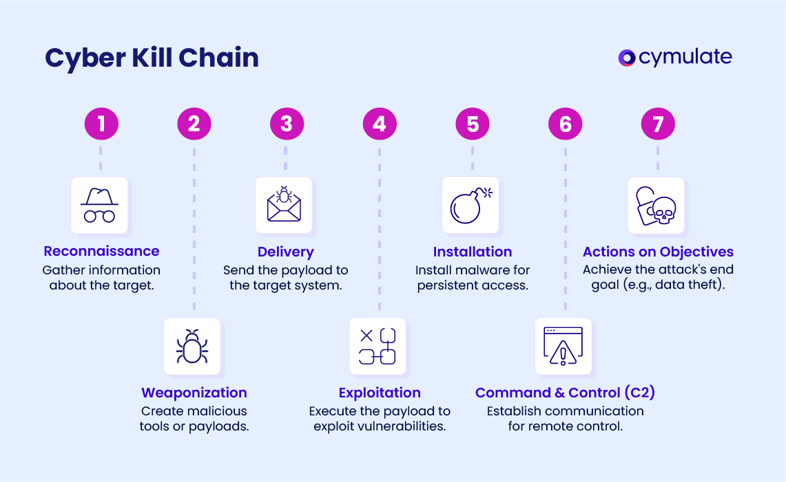
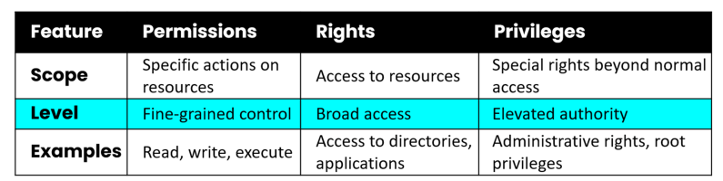
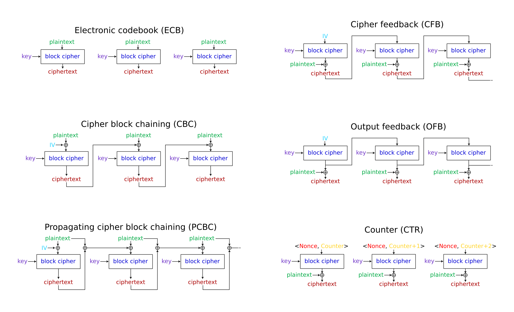

# Domain 3: Security Architecture and Engineering

## Security Design Principles

* Threat modeling
* Least privilege
* Defense in depth&#x20;
* Fail securely
* Separation of duties
* Keep it simple and small
* Zero trust or trust but verify
* Privacy by Design
* Share responsibility
  * cloud services
* Secure access service edge

### Principles for Zero Trust

Know your architecture of users, devices and services\
Know your identities of users, services and devices\
Know the health of your users, devices and services\
Use policies to authorize requests\
Authenticate everywhere\
Focus your monitoring\
Don't trust any network, incl. your own\
Choose services designed for zero trust\
treats user identity as the control plane\
assumes compromise / breach in verifying every request\

### Principle by design

privacy should be embedded into every standard, protocol, and process that touches people

* proactive
* privacy as the default
* embed privacy into design
* full functionality
* end-to-end security
* Visibility and Transparency
* Respect for User privacy

## Cyber kill chain

<figure><figcaption></figcaption></figure>

Three of the most popular security architectures:

* Zachman
* Sherwood Applied Business Security Architecture (SABSA)
* The Open Group Architecture Framework (TOGAF)

## Security Models

... are used to determine how security will be implemented, what subjects can access the system, and what objects they will have access to.

"Rules to be implemented to achieve security"

They are a way to <mark style="color:$primary;">formalize</mark> security policy:

<figure><figcaption></figcaption></figure>

typical implemented by enforcing integrity, confidentiality or other controls.

Provides Broad guidelines only.

Three properties:

* **simple security** property
  * describe rules for <mark style="color:$primary;">read</mark>
* **star \* security** property
  * describes rules for <mark style="color:$primary;">write</mark>
* **invocation** property
  * Rules around <mark style="color:$primary;">invocations (calls)</mark>, such as to subjects

### State machine model

* describe a system that is <mark style="color:$primary;">always secure</mark>, no matter what state it is in
* based on computer science: finite state machine (FSM)
* state: snapshot of a system at a specific moment in time. All state transitions must be evaluated
* if each possible state transition results in another secure state, system can be called secure state machine

### Information flow model

* focuses on controlling the <mark style="color:$primary;">flow of information</mark>
* based on state machine model
* Biba and Bell-LaPaDula

### Non-interference model

* loosely based on the information flow model
* concerned how actions of a subject or a higher security level affect the system state
* subject a (high) should not be seen, affect or interfere with the actions of subject B (low)
* form of protection against malicious programs such as backdoors and rootkits

### **lattice-based mode**l&#x20;

* ... are used to define the levels of security that an object may have and that a subject may have access to
* based on the interaction between any
  * objects and subjects
* is like a ladder, layers going up and down. Requires layers of security.

### **rule-based model**

specific rules dictates how security operates

All other models listed in CISSP study without Biba and Bell-LaPaDula

| Model                      | What it is (simple)                                                                                                          | What it enforces                                                                     | Quick example                                                                                                        |
| -------------------------- | ---------------------------------------------------------------------------------------------------------------------------- | ------------------------------------------------------------------------------------ | -------------------------------------------------------------------------------------------------------------------- |
| **State Machine Model**    | Treats a system as **states** and **transitions**. If you start secure and only do allowed transitions, you **stay secure**. | Every change must keep the system in a **secure state**.                             | Bell-LaPadula/Biba are built as state-machine models: each operation is checked so it can’t break policy.            |
| **Information Flow Model** | Focuses on **where data is allowed to flow** (who/what can send or receive).                                                 | **Allow only permitted flows**, block illegal ones to prevent leakage/contamination. | “No read up / no write down” (Bell-LaPadula) and “No read down / no write up” (Biba) control info movement.          |
| **Non-Interference Model** | Strong form of isolation: **high-level actions must not change anything a low-level user can observe**.                      | Prevents **signals/covert channels** from high → low.                                | In a multi-level system, admin (High) activity can’t cause timing/log/output changes visible to regular users (Low). |

<figure><figcaption></figcaption></figure>

Biba, Star Model, Bell-LaPadula, Clark-Wilson, Brewer-Nash (Chinese Wall Model)

| Layer / Lattice based models                                                           | Rule-based model           |
| -------------------------------------------------------------------------------------- | -------------------------- |
| 
Bell-LaPadula 
<ul><li>addresses only <strong>confidentiality</strong></li></ul> | Information Flow           |
| 
Biba
<ul><li>addresses only <strong>integrity</strong></li></ul>                 | Clark-Wilson               |
|                                                                                        | Brewer-Nash (Chinese Wall) |
|                                                                                        | Graham-Denning             |
|                                                                                        | Harrison-Ruzzo-Ullman      |

### Bell-LaPadula

* state machine <mark style="color:$primary;">enforces confidentiality</mark>
* m<mark style="color:$primary;">andatory access control</mark>
  * to enforce DoD multilevel security policy (<mark style="color:$primary;">Government</mark>!!)
* simple security property
  * no read up
* start \* security property
  * no write down

### Biba

* lattice-based model to address integrity
* simple integrity property
  * no read down
* start integrity property
  * no write up
* invocation property
  * <mark style="color:$primary;">prohibits</mark> subject invoking a subject at a <mark style="color:$primary;">higher level</mark>

| Aspect                   | Bell-LaPadula                                                                                                                                                                | Biba                                                                                                                                                                     |
| ------------------------ | ---------------------------------------------------------------------------------------------------------------------------------------------------------------------------- | ------------------------------------------------------------------------------------------------------------------------------------------------------------------------ |
| _Primary Goal_           | <mark style="color:$primary;">**Confidentiality**</mark>—keep secrets from leaking                                                                                           | 
<mark style="color:$primary;"><strong>Integrity</strong></mark>—keep trusted data from being corrupted. prevents unauthorized subjects from making any changes
 |
| _Key Rule Mnemonics_     | <mark style="color:$primary;">**No-Read-Up / No-Write-Down**</mark>(“You can’t look at material above your clearance, and you can’t send classified data to a lower level.”) | <mark style="color:$primary;">**No-Write-Up / No-Read-Down**</mark>(“You can’t contaminate higher-integrity data, and you shouldn’t trust lower-quality data.”)          |
| _Typical Labels_         | Unclassified → Confidential → Secret → Top Secret                                                                                                                            | Untrusted → User → Operator → System                                                                                                                                     |
| _Where You’ll See It_    | Military/Intel MLS networks, SELinux MLS, cross-domain guards                                                                                                                | Safety-critical systems, financial transaction ledgers, industrial control, medical records                                                                              |
| _Ignored CIA Components_ | Integrity & Availability                                                                                                                                                     | Confidentiality & Availability                                                                                                                                           |
| Typical Scenario         | A Secret-cleared analyst saves her finished report as **Top Secret**.                                                                                                        | Operating-system kernel (high integrity) writes log entries to a user-readable “/var/log” file (low integrity).                                                          |

### **Lipner**&#x20;

... is an implementation (not model) that combines the best features of Bell-LaPadula and Biba

demonstrating how to blend confidentiality & integrity constraints

### Clark-Wilson

well-formed transactions, separation of duties, and the subject-TP-object ‘triple’ with CDIs/UDIs

rule-based model focuses only on integrity

* constrained data item (CDI)
  * any data item whose integrity is protected by the security model
* unconstrained data item (UDI)
  * any data item that is not controlled by the security model
    * can be manipulated by users
* integrity verification procedure (IVP)
  * procedure that scans data items and confirms their integrity
* Transformation procedures (TPs)
  * abstract operations such as read, write and modify
  * are the only procedures that are allowed to modify a CDI

Focus on Integrity / Adds on to <mark style="color:$primary;">Biba model</mark>

1. Prevent unauthorized subjects from making any changes (=Biba)
2. Prevent <mark style="color:$primary;">authorized</mark> subjects from making bad changes
3. Maintain <mark style="color:$primary;">consistency</mark> of the system

Rules of integrity:

* Wel-formed transactions:
  * Good, consistent data. Only perform operations in a manner that won't compromise the integrity of objects
* separation of duties
  * One person shouldn't be allowed to perform all tasks related to a critical function.
* access triple
  * Subject > Program > Object\
    Subject cannot directly access an object. Database access must go through a program that enforces access rules.

**Access control triplet**\
Subject has no longer direct access to the object:

<figure><figcaption></figcaption></figure>

### Take Grant Model

confidentiality-based model

Four basic operations:

* take
* grant
* create
* revoke

### Brewer-Nash (Chinese Wall)

flow model\
primary goal: Prevent conflict of interest.

Example: Banking: Retail Investments and Merger & Acquisitions

Other rule-based models (no details mentioned):\
\- Graham-Denning Model\
\- Harrison-Ruzzo-Ullman model

### Graham-Denning model

formal set of protection rules for which each object has an owner and controller

focused on secure creation and deletion both subject and objects

eight primary protection rules:

* securely create & delete an object
* securely create & delete an subject
* securely provide read, grant, delete and transfer access right

## Evaluation Criteria

formal standards used to measure and compare the security strength of computer systems or products

<figure><figcaption></figcaption></figure>

### TCSEC: Trusted Computer System Evaluation Criteria

* aka Orange book
* published by DoD
* Functional level D,C1,C2,B1,B2,B3,A1 (A1 = verified design, D1 = failed or not tested)
* Most rated at B1, or C2
* measures ONLY confidentiality

### ITSEC: Information Technology Security Evaluation Criteria

* works well in a network environment
* Europe
* F level rating (functionality) = Orange Book
* E level rating (Assurance level)
* E0 - E6

### Common Criteria (ISO-IEC 15408)

* best and well known system / gold standard
  * has basically replaced TCSEC and ITSEC
* EAL rating levels

Components:

* **PP**: Protection profile
  * list of security capabilities that a type or category of security products should pass
* **TOE**: Target of Evaluation
  * Vendor product that's being rated
* **ST**: Security Target
  * Written statement by vendor explaining how functional and assurance specs of the product meet the PP
    * Security Functional Requirements
      * What features exist and how well they work
    * Security Assurance Requirements
      * vendor claimed security functionality and the CC evaluation process align
* Assign EAL (1-7)

| EAL       | Official CC label                                                               | What’s added vs. the level below (key assurance activities)                                                                                               | Typical fit / things to remember                                                                                                                                                                                                                                                                                                                                                                                                                                           |
| --------- | ------------------------------------------------------------------------------- | --------------------------------------------------------------------------------------------------------------------------------------------------------- | -------------------------------------------------------------------------------------------------------------------------------------------------------------------------------------------------------------------------------------------------------------------------------------------------------------------------------------------------------------------------------------------------------------------------------------------------------------------------- |
| **EAL 1** | _<mark style="color:$primary;">Functionally Tested</mark>_                      | 
• Basic functional &#x26; interface spec review

• Black-box testing by lab
                                                                   | 
• “Quick look” confidence for COTS software or pilot deployments.

• Lowest cost; mutually recognized worldwide.
                                                                                                                                                                                                                                                                                                                                               |
| **EAL 2** | _<mark style="color:$primary;">Structurally Tested</mark>_                      | 
• Developer supplies design description

• Independent vulnerability analysis

• Configuration management baseline
                       | • Often chosen when vendor can’t change architecture but needs more assurance for public-sector bids.                                                                                                                                                                                                                                                                                                                                                                      |
| **EAL 3** | _<mark style="color:$primary;">Methodically Tested & Checked</mark>_            | 
• Systematic functional testing

• Development environment controls

• Production version uniquely identified
                            | • Common ceiling for IoT devices, routers sold into regulated markets. • Still globally recognized.                                                                                                                                                                                                                                                                                                                                                                        |
| **EAL 4** | _<mark style="color:$primary;">Methodically Designed, Tested & Reviewed</mark>_ | 
• Low-level design &#x26; source code samples

• Positive &#x26; negative (fault-injection) tests

• Independent penetration testing
     | 
• <strong>Most popular “high watermark” for commercial gear</strong> because cost/time are still manageable.

                                                                                                                                                                                                                                                                                                                                                 |
| **EAL 5** | _<mark style="color:$primary;">Semi-Formally Designed & Tested</mark>_          | 
• Formal model of security architecture

• Rigorous covert-channel analysis

• Advanced penetration testing
                              | • Used for smart-card chips, crypto modules, safety PLC kernels—small code bases, long life-cycles. • Mutual recognition limited to SOGIS (EU) & sponsoring nation.                                                                                                                                                                                                                                                                                                        |
| **EAL 6** | _<mark style="color:$primary;">Semi-Formally Verified Design & Tested</mark>_   | 
• Mathematically supported design proof

• Depth and coverage metrics for testing

• Structured life-cycle &#x26; tool-chain controls
    | 
• Niche—nuclear-command kernels, avionics micro-kernels.

• Very high cost; any patch can trigger recertification. 
                                                                                                                                                                                                                                                                                                                                            |
| **EAL 7** | _<mark style="color:$primary;">Formally Verified Design & Tested</mark>_        | 
• Full formal specification down to source

• Proof that implementation matches model

• Exhaustive vulnerability search &#x26; analysis
 | 
• Practically feasible only for tiny, static TCBs (e.g., one-purpose crypto coprocessors).

• Not mutually recognised; cost, schedule &#x26; road-map freeze make it risky for most vendors. (<a href="https://www.commoncriteriaportal.org/files/ccfiles/CC2022PART5R1.pdf?utm_source=chatgpt.com">Common Criteria Portal</a>, <a href="https://www.commoncriteriaportal.org/files/ccfiles/ccpart3v21.pdf?utm_source=chatgpt.com">Common Criteria Portal</a>)
 |

### Security Control Frames

* aid with the control selection process&#x20;
* provide guidance, best practice
* features from multiple frameworks can be used to meet the needs of the organization

Value of asset drives the selection of controls

## Covert channels

* pass information over a path normally not used for communication
* may not be protected by security tools
* two types
  * Covert Storage (Process A creates or deletes a specific dummy file to send a 1 or 0; Process B checks if the file exists.)
  * Covert Timing (pizza delivery to Pentagon)

## Access control types

### Mandatory Access Control

* access policy determined by <mark style="color:$primary;">systems</mark> (not object owner)
* relies on classification labels
* each object and subject can have <mark style="color:$primary;">multiple labels</mark> (secret, projectx)

mac model classification:

* hierarchical environment
  * ordererd structure, from low security to high security
  * allows objects in higher level to access lower level
* compartmentalized environment
  * no relationship between one security domain and another
  * each domain = seperate isolated compartment
* hybrid environment
  * combines both hierarchical and compartmentalized environments

### Discretionary Access Control

* permits <mark style="color:$primary;">owner</mark> or creator of an object to control and define its accessibility.
* owner has full control by default

### Non-discretionary Access control

* enables the enforcement of system-wide restrictions that override object-specific access control

### Rule-based access Control

* defines specific functions for access to requested objects
* example Firewall policy set

### Role-based access control

* well-defined collection of named job roles

## Certification and Accreditation

You assess a specific system as built and operated in _your_ environment, then a senior official accepts (or rejects) the residual risk and authorizes it to run.

* Two phases. Related but different.
* used to assess the effectiveness of application security as well as operating system and hardware security

Current DoD standards for C\&A: Risk MAnagement Framework (RMF) which replaced (DIACAP and  DITSCAP).

Other US gov branches: CNSSP (Committee on National Security Systems) (replaces NIACAP)

### **Certification**

* product or system is tested to see whether it meets the documented requirements
* evaluation criteria must be chosen at the beginning
* technical evaluation of each part of a computer system to access its concordance with security standards
* test system's hardware, software and configuration in a  production-like environment\

### **Accreditation**&#x20;

* official management decision to use a solution
* usually just for a period of time

### Recertification

* when time period elapses or when significant config changes are made

## Techniques for ensuring CIA

|             |                                                                     |   |
| ----------- | ------------------------------------------------------------------- | - |
| confinement | restrict process to read from and write to certain memory locations |   |
| bounds      | limits of memory a process cannot exceed when reading and writing   |   |
| isolation   | process mode when it is confined through the use of memory bounds   |   |

## Trusted computing base (TCB) & Reference Monitor Concept (RMC)

Security kernel should consist of three properties or characteristics: \
\- completeness (impossible to bypass RMC)\
\- isolation (rules are tamper-proof)\
\- verifiability (verifiy RMC works correclty through logging and monitoring)

RMC: Subject access Object through a set of rules. This activity is logged and monitored

RMC is a concept. RMC implemented is called security kernel

TCB (Trusted Computing Based) is totality of protection mechanism within an architecture

TCB contains, cpu, memory, storage, firmware, os, system kernel, etc.

[https://youtu.be/\_nyZhYnCNLA?list=PL7XJSuT7Dq\_XPK\_qmYMqfiBjbtHJRWigD\&t=10923](https://youtu.be/_nyZhYnCNLA?list=PL7XJSuT7Dq_XPK_qmYMqfiBjbtHJRWigD\&t=10923)

### Processor state

Supervisor state (Privilege mode)\
Problem state (User mode)

System kernel vs security kernel

* system kernel drives OS
* security kernel is implementation of RMC

**TOCTOU** = Time-Of-Check Time of Use ⇒ Race condition

TPM:

* key generation
* storage
* platform integrity
* every tpm has unique and secret endorsement key burned in

**binding**: \
Locked to _this device’s TPM_.\
Encrypting data so it can only be accessed on _that_ specific TPM-equipped system.\
encrypt encryption keys by using the endorsement key.\
endorsement key is only known by TPM\
examples: software license key, password vault (data is tied to device)

**sealing**: \
Locked to _this device’s TPM_ **and** the exact system state.\
decrypts only by the presence of certain software or user authentication.\
examples: bitlocker\
Ties the data to the device AND its known-good boot state.

_Binding locks data to **the chip**; sealing locks data to **the chip + a specific, un-compromised system state.**_

Emanations: unseen things leaking out of systems like radio waves, light, sound and so on

Emanations protection

Shielding (TEMPEST): Walls, Faraday cages

White Noise: Strong single of random noise to hide data transfer

Control Zone: prevent access or proximity to locations

CIS hardening guides: Best practice for hardening

Data warehouse vs Big Data

* Data warehouse = polished, schema-on-write store for trusted, repeatable business reporting.
* Big-data platform = massive, schema-on-read playground for ingesting raw, varied data and running exploratory analytics at scale.

| Dimension           | Traditional Data Warehouse                                                                                  | Big-Data Platform / Data Lake                                                                                  |
| ------------------- | ----------------------------------------------------------------------------------------------------------- | -------------------------------------------------------------------------------------------------------------- |
| **Primary mission** | 
<em>Consistent, trusted reporting</em> — KPIs, regulatory &#x26; financial statements, dashboards
 | 
<em>Exploratory &#x26; large-scale analytics</em> — data science, real-time stream processing, AI/ML
 |
| **Typical data**    | Highly structured, relational, cleaned & conformed (star/snowflake schemas)                                 | Multi-structured: logs, click-streams, images, IoT sensor feeds, text, plus RDBMS extracts                     |

Two important insights:

Inference: deducing information from evidence and reasoning rather than from explicit statements\
Aggregation: Pulls data into one one location

ICS: Industrial Control Systems

* general term used to describe control systems related to industrial processes and critical infrastructre.

Three primary types:

* SCADA (Supervisory Control and Data Acquistion
* DCS (Distributed Control System
* PLC (Programmable Logic Controller

OT is a broader term than ICS. refers to hardware and software used to monitor and control physiclal rpocesses, devies and industrial systems.

ICS focuses on control and automation of industrial processes.

* **Industrial Control Systems (ICS)** are the specialized control loops—PLC-, SCADA-, and DCS-based equipment—that directly monitor and automate industrial processes (valves, motors, conveyors).
* **Operational Technology (OT)** is the bigger umbrella: _all_ hardware + software that interfaces with the physical world in a plant or utility—including the ICS plus supporting networks, HMIs, historians, safety systems, and field sensors.

OT examples which are not ICS:

* Building management / HBAC controller
* Electronic badge-access door
* CCTV security

Three major types&#x20;

| Dimension                        | PLC                                                                     | DCS                                                                         | SCADA                                                                                                             |
| -------------------------------- | ----------------------------------------------------------------------- | --------------------------------------------------------------------------- | ----------------------------------------------------------------------------------------------------------------- |
| **Primary role**                 | Direct, deterministic control of one machine or a small cell            | Continuous, closed-loop control of an entire plant or production unit       | Remote monitoring & supervisory control of widely scattered assets                                                |
| **Typical scope**                | _Machine-level_ (single press, mixer, conveyor)                         | _Plant-level_ (refinery area, paper-mill line)                              | _Regional_ or _multi-site_ (pipeline, power grid)                                                                 |
| **Architecture**                 | Stand-alone ruggedized controller, ladder logic, no OS (or a tiny RTOS) | Network of controllers + central ops consoles on a high-speed control LAN   | Hierarchical: RTUs/PLCs in the field, telemetry links (radio, cellular, fiber) back to a central HMI/SCADA server |
| **Latency / timing**             | Milliseconds (hard real-time)                                           | 50–250 ms loops (soft real-time)                                            | Seconds to minutes (event-driven, not hard real-time)                                                             |
| **Operator interface**           | Usually none or a small local panel; programming via laptop             | Multi-screen control room with rich HMI & historian                         | Control center with large wall displays, alarm management, trending                                               |
| **Where security controls live** | Device hardening, physical locks, application whitelisting              | Segmented control LAN, role-based HMI access, controller firmware integrity | Network DMZs, encrypted WAN links, redundant master stations, incident response procedures                        |
| **Typical industries**           | Packaging, automotive, bottling, discrete manufacturing                 | Oil & gas refining, chemicals, nuclear, large water treatment               | Electric transmission, pipelines, water distribution, rail, building automation                                   |
| **Failure impact**               | Downing one machine                                                     | Loss of an entire production area                                           | Loss of service over large geography (potential critical-infrastructure outage)                                   |

### Cloud

Resource pooling: sharing cpu, disk and network with other parties.

CaaS: Container as a Service\
FaaS: Function as a Service

* serverless and microservices
* AWS lambda
* Billing is per invocation and per millisecond of CPU/RAM
* Event-driven, stateless, short-lived

private cloud, public cloud, community cloud

GovCloud created by AWS, community cloud for government agencies in the US

SPML

* deprecated
* OASIS standard (Organization for the Advancement of Structured Information Standards)
* Provisioning only (creating, disabling user accounts)

### Edge computing

* distributed computing approach that can reduce latency, increase bandwidth availability
* process is done closer to the source of data
  * locally, far from the cloud
* IOT
* process on the device (motion detection camera)

### Fog computing

* places gateway devices in the field to collect and correlate data centrally at the edge
* iot gateway aggregates data run anomaly and sends summary to cloud

XSS&#x20;

Stored/persistent and reflected. Target is client

CSRF persistence facilitated by cookies in browsers. Target is web server

XSS Stored: Store javascript in comment. Send sensitive cookie data to attacker

XSS reflected/non-persistent: Malicious URL containing XSS&#x20;

CSRF: Forged attack. Attacker sends action (fund transfer) as hyperlink to victim

Salt: append unique password by random string for each user individually\
Pepper: **single secret** (shared across users) stored separately from the hashes

purchase key attack: bribe someone to get the key\
rubber hose attack: user of duress or torture

| Ticket attack      | What’s forged                                                        | Secret you must steal                                                                     | Scope of what you can impersonate                                                           | Contact with Domain Controller (DC) when the fake ticket is used                                                        | Why it’s valuable / typical OPSEC goal                                                                                                                                                                                                                                                                          |
| ------------------ | -------------------------------------------------------------------- | ----------------------------------------------------------------------------------------- | ------------------------------------------------------------------------------------------- | ----------------------------------------------------------------------------------------------------------------------- | --------------------------------------------------------------------------------------------------------------------------------------------------------------------------------------------------------------------------------------------------------------------------------------------------------------- |
| **Golden Ticket**  | **TGT** (Ticket-Granting Ticket)                                     | _KRBTGT_ account key from a DC                                                            | **Any** user, any computer, any service in the domain                                       | Only when you first request service tickets; forged TGT itself never came from the DC                                   | “God-mode.” Total, long-term domain persistence and easy lateral movement. ([crowdstrike.com](https://www.crowdstrike.com/en-us/cybersecurity-101/cyberattacks/golden-ticket-attack/))                                                                                                                          |
| **Silver Ticket**  | **TGS** (service ticket) for one SPN                                 | Hash/key of that **single service account** (e.g., HTTP/web-server$, MSSQLSvc, computer$) | **Only that service** (but full privilege inside it)                                        | **None.** The fake TGS is presented straight to the target service, so the DC never validates it                        | Perfect for stealthy, service-level persistence or privilege escalation without lighting up DC logs. ([crowdstrike.com](https://www.crowdstrike.com/en-us/cybersecurity-101/cyberattacks/silver-ticket-attack/))                                                                                                |
| **Diamond Ticket** | A **legitimate TGT that you decrypt, tamper (PAC), then re-encrypt** | _KRBTGT_ key **and** a real TGT (grabbed with normal AS-REQ)                              | Domain-wide like Golden, but ticket “looks” more genuine because it really came from the DC | Normal Kerberos flow (AS-REQ/REP occurred), so the ticket has matching timestamps/metadata; harder to flag as synthetic | Blends in with normal traffic; PAC tweaks give instant Domain-Admin without the obviously fake, never-issued Golden ticket. ([Huntress](https://www.huntress.com/blog/recutting-the-kerberos-diamond-ticket), [Hacking Articles](https://www.hackingarticles.in/diamond-ticket-attack-abusing-kerberos-trust/)) |

**How they play out**

* **Golden Ticket**
  1. Compromise a DC, dump the **KRBTGT** hash.
  2. Mint TGTs for any identity and set absurd lifetimes (years).
  3. Request service tickets at will; defenders see “valid” Kerberos traffic with no preceding logon.
* **Silver Ticket**
  1. Dump the password/NTLM or AES key of a **service account** (often via local admin rights on a box that hosts the service).
  2. Forge a TGS offline, encrypting it with that service’s key.
  3. Present it directly to the service; the DC is never asked, so no KDC-level detection.
* **Diamond Ticket**
  1. Send a normal **AS-REQ** and receive a real TGT.
  2. Decrypt it with the stolen KRBTGT key, modify the **PAC** (add Domain-Admins SID, change username, etc.).
  3. Re-encrypt and reuse; because there _was_ an earlier AS-REQ/REP, log timelines line up and traditional “ticket appeared from nowhere” rules fail.

## Cryptographie

Goals:

* Confidentiality
* Integrity
* Authenticity (instead of Availability)
* Non-repudiation
  * of Origin: Cannot deny sender sent message
  * of Delivery: Receiver cannot deny received message
* Access Control

**Key clustering**: two different keys generate same ciphertext for same plaintext. Similar to collision in hashes

**Work Factor**: estimated amount of time or effort required to break a **cryptosystem**

**Substitution:** <mark style="color:$primary;">Replace</mark> characters with different characters (Caesar cipher)

**Transposition:** <mark style="color:$primary;">rearrange</mark> the letters of a plaintext message

**Confusion:** If one bit of the key is changed, about half of the bit in the ciphertext should change (key - ciphertext)

**Diffusion:** (shannon property). each plaintext bit's influence is spread over many ciphertext bits

**Avalanche**: determine security and effectiveness of a crypto algorithm. Looks at the degree of confusion and diffusion the a crypto algorithm provides. Ideal case: Single bit -> at least 50 percent change in cipher text!

Rail Fence (ZigZag): simple <mark style="color:$primary;">transposition</mark> cipher. Not secure by modern standard.&#x20;

### Block Cipher Modes

<figure><figcaption></figcaption></figure>

| Property                              | CBC                                               | CFB                                                     | OFB                                           | CTR                                                    |
| ------------------------------------- | ------------------------------------------------- | ------------------------------------------------------- | --------------------------------------------- | ------------------------------------------------------ |
| Name                                  | (Cipher-Block Chaining)                           | (Cipher Feedback)                                       | (Output Feedback)                             | (Counter)                                              |
| **Padding needed?**                   | Yes (last block)                                  | No (stream-like)                                        | No                                            | No                                                     |
| **Parallelizable encryption?**        | **✘** (blocks depend on previous ciphertext)      | ✘                                                       | ✔ (pre-compute keystream)                     | **✔** (independent counters)                           |
| **Parallelizable decryption?**        | ✔                                                 | ✘                                                       | ✔                                             | ✔                                                      |
| **Error propagation**                 | 1 block corrupts itself **and** next block        | Corrupts only the **same** bit position in next segment | Corruption stays local (bit-wise)             | Corruption stays local (bit-wise)                      |
| **Bit flipping attack detection?**    | ✔ (changes plaintext of two blocks unpredictably) | Partial (1-segment)                                     | **None** (acts like stream cipher)            | None (stream-like)                                     |
| **IV reuse catastrophic?**            | Serious but limited                               | Serious                                                 | **Yes** (identical keystream leaks plaintext) | **Yes** (identical keystream leaks via XOR)            |
| **Hardware / real-time friendliness** | Good for bulk files                               | Good for byte-wise streams                              | Great for noisy channels, satellite           | Excellent for high-speed & multi-core                  |
| **Typical uses**                      | TLS/SSH pre-2013, IPsec ESP(now mostly GCM)       | Legacy real-time (old SSH, modems)                      | Satellite links, payment terminals            | TLS 1.3, IPsec GCM/CCM, disk encryption, CPUs (AES-NI) |

Summary to learn:

* **ECB**: Electronic Codebook Mode:
  * 64-bit blocks
  * simple & least secure
  * same plaintext block, creates same encrypted block (pinguin)
* **CBC**: Cipher Block Chaining
  * each block of encrypted text is XORed with the block of ciphertext immediately preceding
  * Errors propagate
* **CFB**: Cipher Feedback
  * streaming version of CBC
  * use memory buffers of same block size
  * errors propagate
* **OFB**: Output Feedback:
  * Similar to CFB, but XOR <mark style="color:$primary;">plain text with a seed value</mark>
  * no chaining
*   **CTR**: Counter

    * incrementing counter instead of seed

* **GCM**: Galois/Counter mode:
  * counter mode: efficient and parallelizable
  * includes data <mark style="color:$primary;">authenticity</mark>
* **CCM**: Counter with Cipher block Chaining Messaged Authenticaton Code mode:
  * counter mode
  * cipher block chaining message authentication code (CBC-MAC) for <mark style="color:$primary;">authentication</mark>
  * simpler to implement, but slightly lower performance than GCM

Null Cipher: Plaintext ist mixed with a large amount of non-ciphertext. For example first letter of each word in a sentence.

### Symmetric encryption

<figure><figcaption></figcaption></figure>

Advantages: Fast, Strong\
Disadvantages: Key distribution, Scalability, no authentication, integrity or non-repudation.

total keys for n users: n \* (n-1) / 2

RC4 = Stream cipher\
RC5 and RC6 = Block ciphers!

DES: 56 key length, 64 block length\
2-DES: 2 \* 56 key length\
3DES: two or three keys, three iterations of the algorithm

2-DES is susceptible to **meet-in-the-middle** attack. Key size reduced to 56 bit again.\
3DES key size reduced to 112 bits.

**meet-in-the-middle** attack: exploits protocol that use two rounds of encryption

**birthday attack**: attempt to find collision in hash functions.

3DES deprecated by NIST

AES keys sizes: 128bit, 192 or 256. Block size ALWAYS: 128bit.\
Technically block sizes of 192 and 256 supported, but not adopted by US gov

ChaCha: variant of Salsa20.&#x20;

ChaCha8 is the 8-round variant of ChaCha\
ChaCha12 and ChaCha20 with 12 and 20 rounds.\
ChaCha20 generally faster than AES-GCM on CPU that lack AES-NI\

ChaCha20-Poly1305 AEAD:\
Combines ChaCha20 with the Poly1305 hash famliy. Results in authenticated encryption with associated data (AEAD)encrypt data and verify its integrity and authenticity.

AEAD: Authenticated Encryption with Associated Data

AES-GCM and ChaCha20-Poly1305 when confidentiality + integrtiy is needed in a single pass. No separate MAC required

### Hash algorithms

<figure><figcaption></figcaption></figure>

SHA-1 = obsolete; SHA-2 = today’s default; SHA-3 = different design (sponge) + SHAKE options.

### Asymmetric Crypto

**RSA** based on factoring (5 x 3 = 15)\
**Elliptic Curve** based on discrete logarithms (DH, ECC) 2^3 = 8\
**Diffie-Hellman**\
**El Gamals:** extension of DH key exchange algorithm. Depends on modular arthmetic.&#x20;

**Knapsack** algo was cracked and considered <mark style="color:$primary;">unsafe</mark>

RSA: 1970

ECC: introduced in 2000s. Same secyrity for shorter keys. Faster and more efficient

**Hybrid Cryptography**: Use of assymmetric crypto to send key for symmetric crypto.

**MIC**: Message Integrity Controls

MIC checks are designed to ensure that messages remain unchanged from the time of creation to the time they're read

MIC uses hashes (instead of Parity checks, Checksums or CRC)

Accidentail changes: Parity, CRC, Checksums\
Intentional changes: keyed hash, digital signatures

**DSS**: Digital Signature Standard:

* NIST standards FIPS 186-5 defines how to create and verify digital signtures to ensure integrity, authentication and non-repudations
* approved algos: RSA, ECDSA and DSA
* **SHA-1, SHA-2 and SHA-3 message digest**

RA: Registration Authority (proofs Identity for new Certifcate requests)

**Kerckhoff's Principle**: a cryptosystem should be secure even if everything about the system, except the key, is public knowledge

**Key Wrapping / Key encryption keys:**\
Wrap key with another key for safe key transferal (DH for AES key)

### Key recovery methods

* **Split knowledge**: split parts of keys to different people
* **Dual Control**: two individuals needed to unlock vault for security key
* **Key Escrow:** Keys are stored with a trusted thrid party. Cloud computing. Some countries must share with government

Key disposition = key destruction

Crypto shedding good variant to verify data is removed from the cloud

### Cryptanalysis vs Cryptographic

* Cryptanalysis science of:
  * Cracking codes
  * Decoding secrets
  * Breaking cryptographic protocols
  * Finding and correcting weaknesses en encryption algos

| Cryptanalysis attacks  | Cryptographic Attacks |
| ---------------------- | --------------------- |
| cipthertext only       | Man-in-the-middle     |
| known plaintext        | Replay                |
| chosen plaintext       | Temporary files       |
| chosen ciphertext      | Implementaion         |
| liean and differential | Side-Channel          |
| factoring              | Dictionary attacks    |
|                        | Rainbow tables        |
|                        | Birthday              |
|                        | Social engineering    |

### Quantum computing

**Grover algorithm** shows that a quantum computer speeds up these attacks to effectively halve the **symmmetric** key length. 256-bit key becomes a 128-bit **key.**

**Shor's algortihm** can easily break all of the commonly based-key algo based on both factoring and the discrete logarithm problem

* RSA is vulnerable
* Elliptic Curve is vulnerable

**Lattice** based crypto offers some resistance!

Lattice based on shortest vector problem and closest vector problem

## Physical security

Three groups:

* administrative
  * management controls (<mark style="color:$primary;">policies and procedures</mark>)
    * site management
    * facitility construction/selection
    * personnel controls
    * awareness training
    * emergency response and procedures
* logical (technical)
  * implemented through technology
    * access controls
    * ids
    * alarms
    * cctv
    * hvac
    * power supplies
    * fire detection and surpression
* physical
  * protect objects
    * fencing
    * lightning
    * locks
    * mantraps
    * dogs

| Logical security controls | Physical Security |
| ------------------------- | ----------------- |
| preventive                | deter             |
| detective                 | detect            |
| corrective                | correct           |
|                           |                   |

always consider safety and protection of people first

**CPTED**: Crime Prevention Through Environmental Design

* outlines guidelines and best practices regarding the design of buildings and surrounding structures

**Grading**: refers to the slope of the ground. Slope away form building for water.

**Bollards**: Pfosten

**Mantrap**: double set of doors or turnstile

* prevent tailgaiting

**Locks**: are <mark style="color:$primary;">delay controls</mark>! Do not prevent access

Windows:

* Shock sensor. Must be installed on each pane of glass. Detect vibrations related to glass breaking
* Glass break Sensores. Microphone listenes to glass breaking

## Power, Ping and Pipe

|                                    | Short period (millisec)                        | Longer periods (sec+)                         |
| ---------------------------------- | ---------------------------------------------- | --------------------------------------------- |
| **No Power**                       | <mark style="color:$primary;">Fault</mark>     | <mark style="color:$primary;">Blackout</mark> |
| **low voltage** (not enough power) | <mark style="color:$primary;">Sag / Dip</mark> | <mark style="color:$primary;">Brownout</mark> |
| **high voltage** (too much power)  | <mark style="color:$primary;">Spike</mark>     | <mark style="color:$primary;">Surge</mark>    |
|                                    |                                                |                                               |

HVAC: temp and humidity control for sake of people equipment and areas of a build that may require specific temperature and humidity

## Fence

3-4 feet - \~1m deter casual trespasser\
6-7 feet -  \~1.8m hard to climb easily\
8 feet (w/ barbed wire) - 2.4m - will deter intruders

Lights

8 feet high / 2 feet candle power

## Data centers optimal

| Temperature | 18C | 27C |
| ----------- | --- | --- |
| Humidity    | 40% | 60% |

Too much humidty: corrosion. \
Too little humidty: static electricity

## Fire

Fire needs 3 parts: Fuel, Oxygen, heat

### Fire detection

**Flame detectors**: Detected infrared and UV light. Not good for early detection.\
**Smoke Ionization**: radioactive material, ionizes particles that flow bbetween two metal plates. smoke ionization process will be disrupted. Responds quick to flaming/fast fires\
**Smoke Photoelectronic / Optical**: ligh source and a sensor. off-angle light will be refracted more directly into sensor. responds more quickly to smoldering fires.\
**Smoke Dual:** Most sensor today incorperate both ionization and optical sensor.\
Smoke Veda: Best known. Most expensive, but the best. Very Ealry Smoke Detection Apparatus. for very-high value equipment or assets.

Heat detector: Slow, very ineffective early detection tools.

### Fire surpression

**Wet pipe**: Filled with pressurized water. Cheapest solution. Risk of leaks. Freezing risks.\
**Dry pipe**: Filled with some type of pressured gas. Allows the fill the pipes very fast with water.\
**Pre-action**: Will active only on floor where theres actually a fire. Additionally, each sprinkler is activated by heat. Good for people and computers. charged with compressed air.\
**Deluge:** Flows out every sprinkler head. High risk environments like fireworks or explosives factory. sprinklers are open, pipes are empty, water is hold back by a deluge valve

Gas based fire suppression systems:

* more expensive to install and maintain
* typically no damage to equipment
* remove oxygen or interrypt the chemical process.
* can kill everybody in a room!
* commonly used gases: <mark style="color:$primary;">INERGEN, Argonite, FM200 and Aero-K</mark>
* <mark style="color:$primary;">Halon</mark> gas was popular now illegal (environmental damage)

|          |                                                                                                                                   |
| -------- | --------------------------------------------------------------------------------------------------------------------------------- |
| INERGEN  | replacement for Halogen. reduces oxygen concentraion. Same time allows breathable atmosphere.                                     |
| Argonite | mixture of argon and nitrogen. Does not endanger human life.                                                                      |
| FM-200   | clean agent. Does not endanger human life. Does not leave residue (typically found in DC)                                         |
| Aero-K   | ultrafine, potassium-based aerosol can quickly supress fire.                                                                      |
| CO2      | 
Not corrosive to expensive equipment. Too much is used could kill people, because it removes oxygen. Not commonly used.
 |

NFPA 12 therefore mandates **pre-discharge horns, voice messages, and a 20–60 s time delay** so occupants can escape before the gas dumps

### Fire extinguishers

| Class                                                                       | Typical fuel involved                                                                                       | Primary suppression agents you’ll find inside the extinguisher |
| --------------------------------------------------------------------------- | ----------------------------------------------------------------------------------------------------------- | -------------------------------------------------------------- |
| **A (Ash)**                                                                 | **Ordinary combustibles**: wood, paper, cloth, trash, many plastics                                         | Water, foam, dry chemicals                                     |
| **B (Boil)**                                                                | **Flammable liquids & gases**: gasoline, oil, solvents, alcohol, grease, propane                            | Gas, soda acid, CO2, foam, dry chemicals                       |
| **C (Conductive)**                                                          | **Energized electrical equipmen**t: panels, motors, servers, wiring runs                                    | Gas, CO2, dry chemicals                                        |
| **D (Dilythium)**                                                           | **Combustible metals**: magnesium, sodium, potassium, titanium, zirconium, lithium-ion battery anodes, etc. | Dry powders                                                    |
| 
<strong>K</strong> (U.S.) / <strong>F</strong> (Europe) (Kitchen)
 | Commercial **cooking** oils & fats: deep-fat fryers, salad-oil, lard                                        | Wet chemicals                                                  |
|                                                                             |                                                                                                             |                                                                |

### Electromagnetic interference

* <mark style="color:$primary;">common</mark> mode noise: generated by difference in power between hot and ground wires
* <mark style="color:$primary;">differential-mode (aka traverse</mark> mode) noise generated by difference in power between hot and neutral wires

## Other

SIEM: Security Information Event Manager

* real-time monitoring, traffic analysis & notification

SOAR: Security Orchestration Automation & Response

* alert and response automation with threat-specific playbooks

| Concept                                 | What it is                                                    |
| --------------------------------------- | ------------------------------------------------------------- |
| **SOA (Service-Oriented Architecture)** | Build systems as **enterprise services** that many apps share |
| **Microservices**                       | Build one app as many **small, independent services**         |

CASB: Cloud access security broker

* security policy enforcement solution that may be installed on-prem or in the cloud
* shadow it prevention

**Multiprogramming**: multitasking but takes place on mainframe systems

**single state processing**: processors are capable of operating at only one security level at a time

multistate processing: can operate at multiple security levels at once. less common

user mode: limited instruction set

privileged mode: aka system mode, kernel mode, supervisory mode. Controlled system operations.

primary storage: ram

secondary storage: magnetic, flash, optical media

Layering: different realms of security <mark style="color:$primary;">within a process</mark> and limits communication between them

Type 1 hypervisor: native or bare-metal hypervisor. no host os

Type 2 hypervisor: regular os is present, installed as another software application.

CASB: cloud access security broker (CASB). Shadow it. installed on-prem or in the cloud.

## 2024 Update

Secure Access Service: SASE

brings together networking and security functions

* Firewall services
* Secure web gateway
* Anti-malware services
* IPS
* CASB

### Cryptographic life cycle

FIPS 140-2: Federal Information Processing standard

* aid in protection of digitally stored unclassified, yet sensitve information
* non-military

Level 1: lowest level of security\
Level 2: specifies the security requirements for cryptographic modules that protect sensitive information\
Level 3: Requires physical protections to ensure a high degree of confidence that any attempts to tamper are evident and detectable

FIPS 140-3: released 2202, supersedes FISP 140-2

Level 1: externally tested algorithms\
Level 2: adds requirements for physical tamper-evidence and role-based authentication\
Level 3: adds requirements for physical tamper-resistance, seperation between interfaces\
Level 4: makes the physical security requiements more stringet, tamper-active: erasing content of the device if it detects various forms of environmental attacks

cryptographic modules

Type

|          |                                                                                                                     |   |
| -------- | ------------------------------------------------------------------------------------------------------------------- | - |
| Hardware | SafeNet Luna HSM (Thales0                                                                                           |   |
| Software | 
OpenSSL FIPS Object modules Microsoft windows Crypto modules
                                              |   |
| Cloud    | 
Microsoft Azure Key Vault Amazon Key Management Service (KMS) Google Cloud Key Mangament Service (KMS)
 |   |

Other key management terms and concepts

Level protection:

* crypto keys must be secure at the same level of control or higher as the data they protect

Key Recovery:

* recover a key for a particular users, without that user's cooperation

Key Escrow:

* keys are held by a trusted third party in a secure environment

Quantum key Distribution

* enables two parties to generate a shared random secret key known only to them
* ability to detect eavesdropping by any third party
* relies on having an authenticated classical channel of communication

