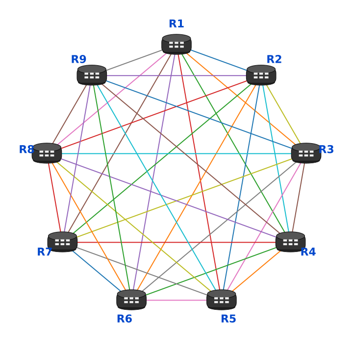

# Lab 5: Solving iBGP Route Propagation with Full Mesh and Route Reflectors

## Objective

In the previous lab, we saw that iBGP-learned routes are not advertised to other iBGP peers by default. We show two different approaches on how to achieve this. With a **Full Mesh** config and with **Route Reflectors.**

## Topology <a href="#topology" id="topology"></a>

<figure><figcaption></figcaption></figure>

iBGP Settings:

| Router | AS    | Interface IP                      | BGP Neighbor                      | Loopback Lan Network |
| ------ | ----- | --------------------------------- | --------------------------------- | -------------------- |
| R1     | 65001 | <p>172.18.12.0<br>172.18.13.0</p> | <p>172.18.12.1<br>172.18.13.1</p> | 10.10.1.1/24         |
| R2     | 65001 | 172.18.12.1                       | 172.18.12.0                       | 10.10.2.1/24         |
| R3     | 65001 | 172.18.13.1                       | 172.18.13.0                       | 10.10.3.1/24         |

## Packet Captures <a href="#packet-captures" id="packet-captures"></a>

| PCAP File                               | Description                                                    | What to look for                                                                                                              |
| --------------------------------------- | -------------------------------------------------------------- | ----------------------------------------------------------------------------------------------------------------------------- |
| lab5-ibgp-full-mesh.pcapng              | Full mesh ibgp topology. All 3 routers are peered.             | R3 send BGP updates to R1 and R2 directly (packet #34 #38)                                                                    |
| lab5-ibgp-route-reflector-client.pcapng | R1 is configured as route reflector.                           | R1 forwards the route announced from R3 to R2 (packets #12 and #29) ORGINATOR\_ID and CLUSTER\_LIST path attributes are added |
| lab5-ibgp-next-hop-self-rr.pcapng       | R1 is still configured as route reflector and next-hop-self-rr | Same as the route reflector lab, this time the NEXT\_HOP address is replaced between R1 and R2. (packet #31)                  |

## Full Mesh iBGP

We continue with the iBGP lab from the previous Lab. I'll repeat the commands:

```
config vdom
edit R1
config router bgp
    set as 65001
    config neighbor
        edit "172.18.12.1"
            set remote-as 65001
        next
        edit "172.18.13.1"
            set remote-as 65001
        next
    end
end
next
edit R2
config router bgp
    set as 65001
    config neighbor
        edit "172.18.12.0"
            set remote-as 65001
        next
    end
end
next
edit R3
config router bgp
    set as 65001
    config neighbor
        edit "172.18.13.0"
            set remote-as 65001
        next
    end
end
```

```
config vdom
edit R3
config router bgp
config network
edit 0
set prefix 10.10.3.0/24
next
end
end
```

Verify that the 10.10.3.0/24 is announced from R3 to R1

```
FGT02 (R1) # get router info routing-table bgp
Routing table for VRF=0
B       10.10.3.0/24 [200/0] via 172.18.13.1 (recursive is directly connected, R1R3-1-0), 00:00:49, [1/0]


FGT02 (R1) # get router info bgp summary 

VRF 0 BGP router identifier 172.17.0.1, local AS number 65001
BGP table version is 1
1 BGP AS-PATH entries
0 BGP community entries

Neighbor    V         AS MsgRcvd MsgSent   TblVer  InQ OutQ Up/Down  State/PfxRcd
172.18.12.1 4      65001       4       4        0    0    0 00:01:22        1
172.18.13.1 4      65001       4       4        0    0    0 00:01:22        1

Total number of neighbors 2
```

To build a peering between R3 and R2 we need make sure 172.18.3.1 can reach 172.18.12.1.

Right now there are no routes on R3 to reach R2:

```
FGT02 (R3) # get router info routing-table details 172.18.12.1
% Network not in table
```

We'll add static routes to both R2 and R3 so they can reach other through R1:

```
config vdom
edit R2
    config router static
        edit 0
            set dst 172.18.13.0 255.255.255.0
            set gateway 172.18.12.0
            set device "R1R2-1"
        next
    end
 next
 edit R3
     config router static
         edit 0
             set dst 172.18.12.0/31
             set gateway 172.18.13.0
             set device "R1R3-1-1"
         next
    end
 next
```

Verify you can ping R2 from R3:

```
FGT02 (R3) # execute ping 172.18.12.1
PING 172.18.12.1 (172.18.12.1): 56 data bytes
64 bytes from 172.18.12.1: icmp_seq=0 ttl=254 time=0.4 ms
64 bytes from 172.18.12.1: icmp_seq=1 ttl=254 time=0.2 ms
^C
--- 172.18.12.1 ping statistics ---
2 packets transmitted, 2 packets received, 0% packet loss
round-trip min/avg/max = 0.2/0.3/0.4 ms

FGT02 (R3) # execute traceroute 172.18.12.1
traceroute to 172.18.12.1 (172.18.12.1), 32 hops max, 3 probe packets per hop, 72 byte packets
 1  172.18.13.0  0.464 ms  0.243 ms  0.112 ms
 2  172.18.12.1  0.177 ms  0.158 ms  0.097 ms
```

Now let's configure the BGP peering between R2 and R3 by defining the neighbors:

```
config vdom
edit R3
config router bgp
    config neighbor
        edit "172.18.12.1"
            set remote-as 65001
        next
    end
end
next
edit R2
config router bgp
    config neighbor
        edit "172.18.13.1"
            set remote-as 65001
        next
    end
end

```

Verify R2 has neighbor adjacency with R3 and received the 10.10.3.0/24 route

<pre><code>FGT02 (R2) # get router info bgp summary 

VRF 0 BGP router identifier 172.17.0.2, local AS number 65001
BGP table version is 2
1 BGP AS-PATH entries
0 BGP community entries

Neighbor    V         AS MsgRcvd MsgSent   TblVer  InQ OutQ Up/Down  State/PfxRcd
172.18.12.0 4      65001      25      25        1    0    0 00:20:07        0
172.18.13.1 4      65001       8       8        1    0    0 00:04:37        1

Total number of neighbors 2

FGT02 (R2) # get router info bgp neighbors 172.18.13.1 routes
VRF 0 BGP table version is 2, local router ID is 172.17.0.2
Status codes: s suppressed, d damped, h history, * valid, > best, i - internal,
              S Stale
Origin codes: i - IGP, e - EGP, ? - incomplete

   Network          Next Hop            Metric     LocPrf Weight RouteTag Path
<strong>*>i10.10.3.0/24     172.18.13.1     0             100      0        0 i &#x3C;-/1>
</strong>
Total number of prefixes 1

</code></pre>

Note that the Next Hop to the network `10.10.3.0/24` is set to `172.18.13.1`. This route is not directly connected on R2. So a valid underlying routing is required. In this lab we used static routes, other IGP routing protocols like OSPF are also common to build the underlay network.

One method to allow iBGP routes to be propagated between all routers is to build a full-mesh iBGP topology. The issue with this approach is that it doesn't scale well. The table below demonstrates how quickly the number of required BGP sessions increases with each additional router.

| iBGP Routers | Full-Mesh sessions |
| ------------ | ------------------ |
| 3            | 3                  |
| 4            | 6                  |
| 5            | 10                 |
| 6            | 15                 |
| 10           | 45                 |

<figure><figcaption></figcaption></figure>

## Route Reflector

Instead of building a full mesh iBGP network, we are going to demonstrate the route reflector.

Let's first start with a clean iBGP lab. Restore the Lab Baseline and run:

```
config vdom
edit R1
config router bgp
    set as 65001
    config neighbor
        edit "172.18.12.1"
            set remote-as 65001
        next
        edit "172.18.13.1"
            set remote-as 65001
        next
    end
end
next
edit R2
config router bgp
    set as 65001
    config neighbor
        edit "172.18.12.0"
            set remote-as 65001
        next
    end
end
next
edit R3
config router bgp
    set as 65001
    config neighbor
        edit "172.18.13.0"
            set remote-as 65001
        next
    end
end
```

```
config vdom
edit R3
config router bgp
config network
edit 0
set prefix 10.10.3.0/24
next
end
end
```

```
config vdom
edit R2
    config router static
        edit 0
            set dst 172.18.13.0 255.255.255.0
            set gateway 172.18.12.0
            set device "R1R2-1"
        next
    end
 next
 edit R3
     config router static
         edit 0
             set dst 172.18.12.0/31
             set gateway 172.18.13.0
             set device "R1R3-1-1"
         next
    end
 next
```

Verify that the 10.10.3.0/24 is announced from R3 to R1

```
FGT02 (R1) # get router info routing-table bgp
Routing table for VRF=0
B       10.10.3.0/24 [200/0] via 172.18.13.1 (recursive is directly connected, R1R3-1-0), 00:00:49, [1/0]


FGT02 (R1) # get router info bgp summary 

VRF 0 BGP router identifier 172.17.0.1, local AS number 65001
BGP table version is 1
1 BGP AS-PATH entries
0 BGP community entries

Neighbor    V         AS MsgRcvd MsgSent   TblVer  InQ OutQ Up/Down  State/PfxRcd
172.18.12.1 4      65001       4       4        0    0    0 00:01:22        1
172.18.13.1 4      65001       4       4        0    0    0 00:01:22        1

Total number of neighbors 2
```

And the we can ping R2 from R3

```
BGP-LAB (R3) # execute ping-options repeat-count 4

BGP-LAB (R3) # execute ping 172.18.12.1
PING 172.18.12.1 (172.18.12.1): 56 data bytes
64 bytes from 172.18.12.1: icmp_seq=0 ttl=254 time=0.3 ms
64 bytes from 172.18.12.1: icmp_seq=1 ttl=254 time=0.2 ms
64 bytes from 172.18.12.1: icmp_seq=2 ttl=254 time=0.2 ms
64 bytes from 172.18.12.1: icmp_seq=3 ttl=254 time=0.2 ms

--- 172.18.12.1 ping statistics ---
4 packets transmitted, 4 packets received, 0% packet loss
round-trip min/avg/max = 0.2/0.2/0.3 ms

```

Now let's configure the route reflector by setting configuring `route-reflector-client` for both neighbors on R1.

```
config vdom
edit R1
config router bgp
    config neighbor
        edit "172.18.12.1"
            set route-reflector-client enable
        next
        edit "172.18.13.1"
            set route-reflector-client enable
        next
    end
end
next
```

R1 can now reflect routes learned from one route-reflector client to the other route-reflector client.

Verify with routing-table

```
BGP-LAB (R1) # sudo R2 get router info routing-table bgp
Routing table for VRF=0
B       10.10.3.0/24 [200/0] via 172.18.13.1 (recursive via 172.18.12.0, R1R2-1), 00:00:06, [1/0]

BGP-LAB (R1) # sudo R2 get router info bgp network 10.10.3.0/24
VRF 0 BGP routing table entry for 10.10.3.0/24
Paths: (1 available, best #1, table Default-IP-Routing-Table)
  Not advertised to any peer
  Original VRF 0
  Local
    172.18.13.1 from 172.18.12.0 (172.17.0.3)
      Origin IGP distance 200 metric 0, localpref 100, valid, internal, best
      Originator: 172.17.0.3, Cluster list: 172.17.0.1 
      Last update: Fri Jun 26 08:44:13 2026
```

Note that 10.10.3.0/24 is reachable via 172.18.13.1 and we received this route recursively through R1.\
Since we already have static routes for 172.18.13.0/24, we know how to reach R3 via the underlying network.

Verify ping from R2 to R3 local Net works:

```
BGP-LAB (R1) # sudo R2 execute ping 10.10.3.1
PING 10.10.3.1 (10.10.3.1): 56 data bytes
64 bytes from 10.10.3.1: icmp_seq=0 ttl=254 time=0.4 ms
64 bytes from 10.10.3.1: icmp_seq=1 ttl=254 time=0.2 ms
```

Now this works great. But this setup still depend on having a valid route to R3. As soon as we remove the underlying static route. R2 does not know how to reach 172.18.13.1 anymore, thus forwards the packet out of the default gateway.

To demonstrate let's remove both static routes:

```
config vdom
edit R2
config router static
delete 1
end
next
edit R3
config router static
delete 1
end
next

```

Now verify what happened to the route on R2:

```
BGP-LAB (global) # sudo R2 get router info routing-table bgp
No route available
```

It's gone! Let's check if R1 still advertise it:

```
BGP-LAB (global) # sudo R2 get router info bgp network 
VRF 0 BGP table version is 1, local router ID is 172.17.0.2
Status codes: s suppressed, d damped, h history, * valid, > best, i - internal,
              S Stale
Origin codes: i - IGP, e - EGP, ? - incomplete

   Network          Next Hop            Metric     LocPrf Weight RouteTag Path
* i10.10.3.0/24     172.18.13.1     0             100      0        0 i <-/->

Total number of prefixes 1
```

```
BGP-LAB (global) # sudo R2 get router info routing-table details 172.18.13.1
% Network not in table
```

It's still being advertised from R1.

But R2 has no route to 172.18.13.1 at all. That's why it's not injected in the routing table (RIB).

Now normally you have a default route. So let's add a default route to a dummy internet interface and see what happens.

This default route is only used to demonstrate recursive next-hop resolution. It is not the correct underlay design for this lab.

```
config global
config system vdom-link
edit "R2NET1-"
set type ethernet
next
end
config system interface
    edit "R2NET1-0"
        set vdom "R2"
        set ip 172.19.0.2 255.255.255.0
        set allowaccess ping
        set type vdom-link
    next
    edit "R2NET1-1"
        set vdom "root"
    next
    end
end
config vdom
edit R2
config router static
    edit 1
        set gateway 172.19.0.1
        set device "R2NET1-0"
    next
end
```

Verify the routing table:

```
BGP-LAB (R2) # get router info routing-table all
Codes: K - kernel, C - connected, S - static, R - RIP, B - BGP
       O - OSPF, IA - OSPF inter area
       N1 - OSPF NSSA external type 1, N2 - OSPF NSSA external type 2
       E1 - OSPF external type 1, E2 - OSPF external type 2
       i - IS-IS, L1 - IS-IS level-1, L2 - IS-IS level-2, ia - IS-IS inter area
       V - BGP VPNv4
       * - candidate default

Routing table for VRF=0
S*      0.0.0.0/0 [10/0] via 172.19.0.1, R2NET1-0, [1/0]
C       10.10.2.0/24 is directly connected, R2-LAN0
B       10.10.3.0/24 [200/0] via 172.18.13.1 (recursive via 172.19.0.1, R2NET1-0), 00:00:31, [1/0]
C       172.17.0.2/32 is directly connected, R2-LO0
C       172.18.12.0/31 is directly connected, R1R2-1
C       172.18.23.0/31 is directly connected, R2R3-0
C       172.18.24.0/31 is directly connected, R2R4-0
C       172.19.0.0/24 is directly connected, R2NET1-0
C       172.30.0.2/32 is directly connected, R2-INTERNET

```

So it's now pointing to our new internet dummy interface: R2NET1-0. This is definitely not the way to reach R3.

What if we just could replace 172.18.13.1 with the IP from R1? Here is where the `next-hop-self-rr` option comes in handy.

## Replacing Next-hop Attribute on the route reflector

Enable the `next-hop-self-rr` option for both neighbors on R1:

```
config vdom
edit R1
    config router bgp
        config neighbor
            edit "172.18.12.1"
                set next-hop-self-rr enable
            next
            edit "172.18.13.1"
                set next-hop-self-rr enable
            next
        end
     end
 end
```

Now re-check what happened to the routing table on R2:

```
BGP-LAB (R2) # get router info routing-table  all
Codes: K - kernel, C - connected, S - static, R - RIP, B - BGP
       O - OSPF, IA - OSPF inter area
       N1 - OSPF NSSA external type 1, N2 - OSPF NSSA external type 2
       E1 - OSPF external type 1, E2 - OSPF external type 2
       i - IS-IS, L1 - IS-IS level-1, L2 - IS-IS level-2, ia - IS-IS inter area
       V - BGP VPNv4
       * - candidate default

Routing table for VRF=0
S*      0.0.0.0/0 [10/0] via 172.19.0.1, R2NET1-0, [1/0]
C       10.10.2.0/24 is directly connected, R2-LAN0
B       10.10.3.0/24 [200/0] via 172.18.12.0 (recursive is directly connected, R1R2-1), 00:01:49, [1/0]
C       172.17.0.2/32 is directly connected, R2-LO0
C       172.18.12.0/31 is directly connected, R1R2-1
C       172.18.23.0/31 is directly connected, R2R3-0
C       172.18.24.0/31 is directly connected, R2R4-0
C       172.19.0.0/24 is directly connected, R2NET1-0
C       172.30.0.2/32 is directly connected, R2-INTERNET

```

Now the routes for 10.10.30/24 on R2 are correct. The interface is R1R2-1.

Ping still won't work, because R3 still does not know on how to reach R2. So we'll announce the local LAN network on R2 (10.10.2.0/24).

```
config vdom
edit R2
    config router bgp
        config network
            edit 1
                set prefix 10.10.2.0 255.255.255.0
            next
        end
    end
end
```

This route is also reflected on R1 and next hop value is replaced. Let's check the Route on R3 and ping from R2

```
BGP-LAB (R2) # sudo R3 get router info routing-table bgp
Routing table for VRF=0
B       10.10.2.0/24 [200/0] via 172.18.13.0 (recursive is directly connected, R1R3-1-1), 00:00:36, [1/0]

```

```
BGP-LAB (R2) # execute ping-options source 10.10.2.1

BGP-LAB (R2) # execute ping 10.10.3.1
PING 10.10.3.1 (10.10.3.1): 56 data bytes
64 bytes from 10.10.3.1: icmp_seq=0 ttl=254 time=0.4 ms
64 bytes from 10.10.3.1: icmp_seq=1 ttl=254 time=0.2 ms
^C
--- 10.10.3.1 ping statistics ---
2 packets transmitted, 2 packets received, 0% packet loss
round-trip min/avg/max = 0.2/0.3/0.4 ms
```

## Links




